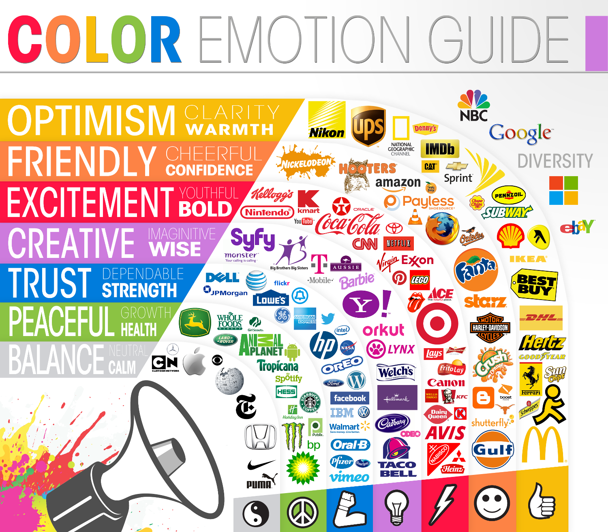

### Goals

In this lesson we'll talk about:

* the meanings associated with different colors
* different type of color relationships
* color properties and terms

### The Power of Color

***

> #### *"Color is a powerful form of communication. We are so attracted to color and so repelled by it that even if the coolest design were presented to us, if we didn't like the color, we wouldn't like it at all."* - Joanne Chang, from Hack Design's ["Building Color Confidence"](https://hackdesign.org/lessons/17)

***

Whether or not we consciously realize it, colors carry meaning. The exact meaning can be subjective but can be swayed by other design choices and context, but it is often heavily influenced by the culture someone grew up in. Therefore, it is important to be aware that colors can have very different connotations and associations based on different cultural traditions, countries, and religious beliefs. Take white, for example. White often symbolizes purity, fulfillment, and brightness. However, in some cultures it is more closely associated with death, is often used as a color of mourning, and is frequently used in funerals. One color, two vastly different meanings.

Let's talk about some common meanings tied to colors.

#### Color Groups

There are three groupings that colors fall into: warm, cool, and neutral. The colors inside of these groups tend to share similar meanings: *warm colors* are generally positive and energetic, *cool colors* are calmer and relaxing, and *neutral colors* are more conservative.

#### Warm Colors

##### Red

Red covers a huge range in what it can represent. From war to love and anger to passion -- it can mean many things. It has been associated with both the Devil and Cupid. It can represent danger (like a stop light) or importance (like the red carpet at an awards show).

In different cultures it can represent everything from prosperity and wealth to mourning and death.

Red has also been shown to actually have a physical effect on people -- it can raise blood pressure, respiration, and even enhance metabolism.

Since it is such a powerful color, it is often most successful to use it sparingly as an accent color. And remember, you can always experiment with lighter or darker shades to help you invoke different emotions.

##### Orange

Orange is often associated with health and vitality -- it's vibrant and energetic, and can give your color palette a warm, friendly pop without being as aggressive as red.

##### Yellow

Yellow is often associated with happiness and sunshine, and is considered by many to be the brightest and most energizing color. Bright yellow can bring a feeling of happiness to a color palette, and a darker or more gold hue can feel antique.

#### Cool Colors

##### Green

Green is a calming color that can represent growth and abundance, but also envy and lack of experience.

Since it is made by blending blue and yellow, it can range from calming tones (more blue than yellow) to more energized tones (more yellow than blue).

##### Blue

The meaning of blue changes greatly depending on what shade and hue are used. Blues can have meanings ranging from sadness, to responsibility, to peace. Light blues are often calm, bright blues are energizing, and dark blues can represent strength and reliability.

##### Purple

Purple is a combination of red and blue, and depending on the ratio of the mix can take on different attributes of those two colors. Purple can communicate luxury, and softer tones are often associated with romance.

#### Neutral Colors

Neutral colors are great to use as a backdrop for one or two carefully chosen accent colors. When used alone, neutral tones can give a sense of sophistication. Neutral colors include black, white, beige, gray, and ivory.

###### *Image Credit: The Logo Company [Color Logo Design](https://thelogocompany.net/blog/infographics/psychology-color-logo-design/)*

### Color Types

Let's talk about the color wheel!

#### Primary Colors

###### *Image Credit: Site Point [Color Theory 101](https://www.sitepoint.com/color-theory-101-2/)*

Primary colors are the only colors that cannot be created by mixing other colors together. They are red, blue, and yellow. All other colors can be created by mixing these three colors.

#### Secondary Colors

###### *Image Credit: Site Point [Color Theory 101](https://www.sitepoint.com/color-theory-101-2/)*

Secondary colors are created by blending two primary colors. These colors are orange, green, and purple. In the visual representation of our color wheel, these are the colors exactly in between out primary colors.

#### Tertiary Colors

###### *Image Credit: Site Point [Color Theory 101](https://www.sitepoint.com/color-theory-101-2/)*

Tertiary colors are made by mixing a primary color and a secondary color. In the color wheel, these fall between a primary and secondary color.

### Color Combinations

Now that we know how to describe colors, we can dig into tried and true methods of finding successful color pairings.

***

> #### *"Color Theory is, at its core, about developing aesthetically pleasing color relationships"* - Color Design Workbook

***

#### Monochromatic Colors

###### *Image Credit: Wikipedia [Monochromatic Color](https://en.wikipedia.org/wiki/Monochromatic_color)*

This is one color that is extended using tints, shades and tones.

#### Complimentary Colors

###### *Image Credit: Site Point [Color Theory 101](https://www.sitepoint.com/color-theory-101-2/)*

These are two colors that sit directly across from each other on the color wheel. They compliment each other and often have the most contrast, but that doesn't always mean they make for the nicest pairings. A way to get near the same level of contrast and a nicer pairing is to use Split Complimentary Colors.

#### Split Complimentary Colors

###### *Image Credit: Site Point [Color Theory 101](https://www.sitepoint.com/color-theory-101-2/)*

Split Complimentary Colors start with one color and then instead of going straight across the color wheel to the complimentary color, go to either the left of right a couple of colors. This softens the contrast and often gives a nicer, more visually appealing pairing.

#### Analogous Colors

###### *Image Credit: Site Point [Color Theory 101](https://www.sitepoint.com/color-theory-101-2/)*

Analogous colors are group of colors that are close to each other on the color wheel. They have enough contrast to be clearly distinguishable from one another, but because they are very similar they form a harmonious group.

### Color Properties and Terms

Color properties are how we describe and define colors. They allows us to refine a specific color.

#### Hue

Hue defines a "pure color" (in many situations, it can even be used as a synonym for "color"), which is typically a primary or secondary color on the color wheel. You can think of hue as describing the colors you learned to connect with words as a child.

#### Value

Value describes how light or dark a color is. For example: yellow is a light color and will have higher value than a darker color like purple, which will have a lower value.

#### Tone

Tones are made my mixing pure colors (aka hues!) with a neutral or grayscale color. A tone will be softer than the original color. Tints and shades are considered tones.

###### *Image Credit: Site Point [Color Theory 101](https://www.sitepoint.com/color-theory-101-2/)*

#### Tint

A tint is a pure color that has had white added to it. It will be lighter that the original color.

#### Shade

A shade is a pure color that has had black added to it. It will be darker than the original color.

#### Saturation

Saturation defines the range of purity of a color. It goes from 100% pure color to 0% pure color (which becomes grey). A technique to desaturate a color to achieve a tonal grey used by painters is to blend two complimentary colors together. When blended in equal amounts, complimentary colors become a mid-grey. This allows you to find a neutral grey that still visually compliments your accent color (i.e. it is a cool or warm grey, rather than being a strict white-to-black neutral grey).

<!-- ### Your Turn

Time to play around with color. See how much a color can change based on the color it is laid over. Experiment! Try out complimentary colors, try different tints and shades. See what you get!

* [Here's a link to a Codepen](http://codepen.io/LouisaBarrett/pen/MJLRNG?editors=1100) that's ready for you to try out some colors.
* [And here is a link to a great site](http://htmlcolorcodes.com/color-picker/) to show you all the range you can get from one color. -->

## Homework Reading

* [Accessibility: Improving The UX For Color-Blind Users](https://www.smashingmagazine.com/2016/06/improving-ux-for-color-blind-users/)
* [Color Theory For Designers: Creating Your Own Color Palettes](https://www.smashingmagazine.com/2010/02/color-theory-for-designer-part-3-creating-your-own-color-palettes/)
* [The Underestimated Power Of Color In Mobile App Design](https://www.smashingmagazine.com/2017/01/underestimated-power-color-mobile-app-design/)

## Resources

* [HTML Color Picker](http://htmlcolorcodes.com/color-picker/)
